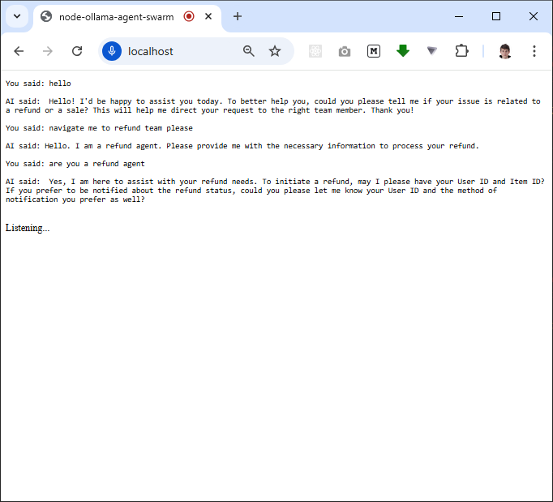
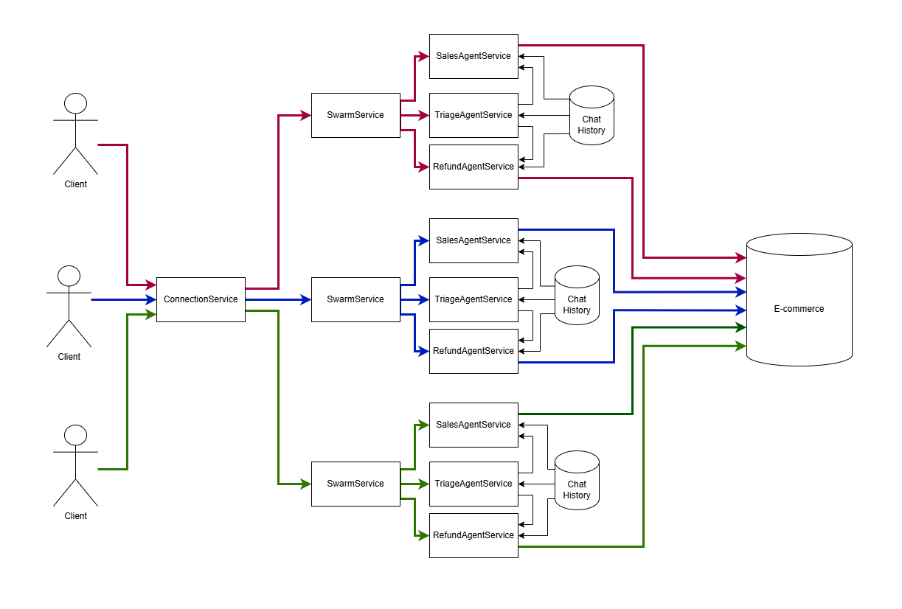

# 🔥 node-ollama-agent-swarm 

> [The OpenAI Agent Swarm](https://github.com/openai/swarm) pattern implementation for [OllamaJS](https://github.com/ollama/ollama-js). Includes TTS synthesis and speech recognition for simplified testing and interaction.



## Main concept



1. Several chat sessions (agents) [execute tool calls](https://ollama.com/blog/tool-support). Each agent can use different model, for example, [mistral 7b](https://ollama.com/library/mistral) for small talk, [nemotron](https://ollama.com/library/nemotron) for business conversation

2. The agent swarm navigate messages to the active chat session (agent) for each `WebSocket` channel [by using `clientId` url parameter](src/routes/session.ts#L5)

3. The active chat session (agent) in the swarm could be changed [by executing function tool](https://platform.openai.com/docs/assistants/tools/function-calling) 

4. Each client sessions [share the same chat history](https://platform.openai.com/docs/api-reference/messages/getMessage) for all agents. Each client chat history keep the last 25 messages with rotation. Only `assistant` and `user` messages are shared, the `system` and `tool` messages are agent-scoped so each agent knows only those tools related to It.

5. Each chat session (agent) has it's [unique system prompt](https://platform.openai.com/docs/api-reference/messages/createMessage#messages-createmessage-role). The chat history implementation is designed to store messages in memory storage (Redis, Tarantool)

**The result**

The model system prompt can be dynamically changed based on the user behaviour. The model interact with the external api based on the user requests

## Getting started

```bash
cp .env.example .env
ollama pull nemotron-mini:4b
# cd docker/mongodb && docker-compose up
# cd docker/redis && docker-compose up
npm install
npm start
```

The entry point of the backend application is [ConnectionPublicService.ts](src/services/public/ConnectionPublicService.ts). The agent swarm with system prompts is placed in the [logic](src/services/logic) folder. The ai functions are places in the [tools](src/services/tools) folder 
